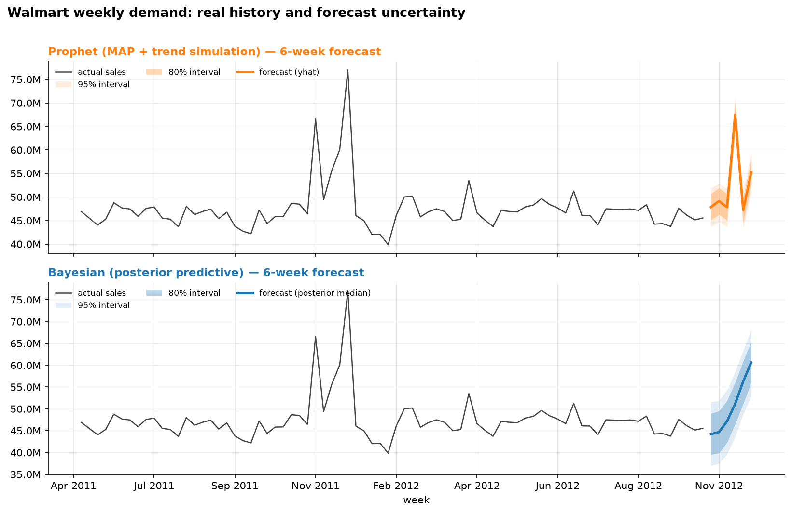
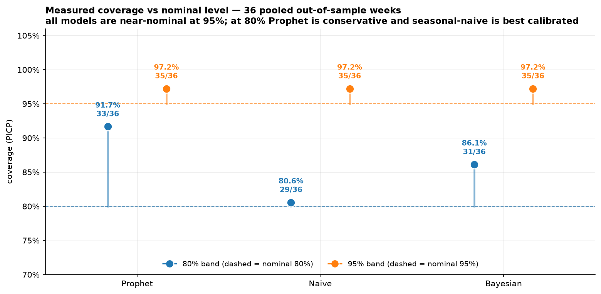
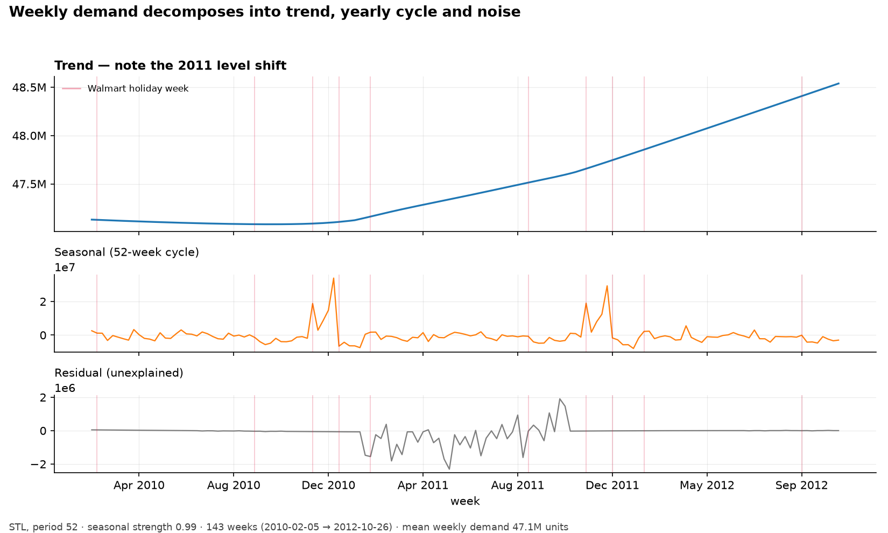
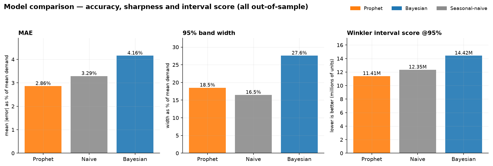
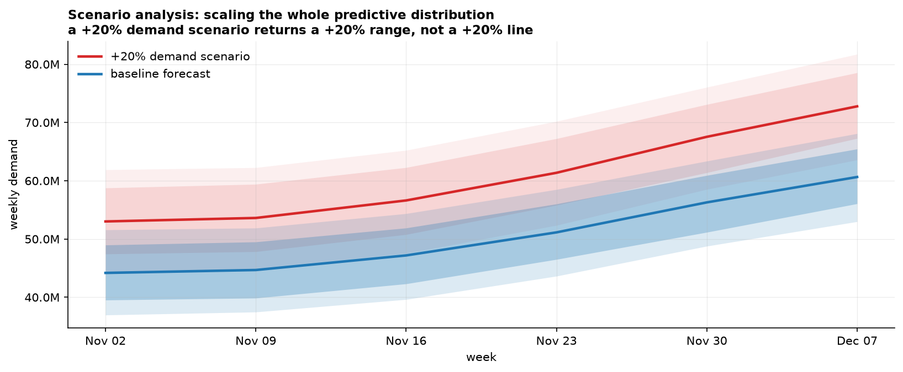

# Time Series Forecasting with Uncertainty

[](https://time-series-forecasting-with-uncertainty.streamlit.app/)

**Try it live →** https://time-series-forecasting-with-uncertainty.streamlit.app/

Retail demand forecasting that reports **how wrong it might be**, not just what
it predicts.

> "Next month's demand is 47.1M units" is not a forecast. "47.1M units, and in
> 95% of comparable historical weeks actual demand landed within ±9M" is a
> decision someone can plan inventory against.

The project fits a point-forecast baseline (Prophet), a **Bayesian structural
demand model** whose intervals come from the posterior predictive distribution,
and a seasonal-naive reference — then *measures* which of them is honest, using
expanding-window walk-forward validation rather than in-sample residuals.

Built on the real **Walmart Recruiting — Store Sales Forecasting** dataset
(45 stores × 99 departments, weekly, 2010-02-05 → 2012-10-26).

## What's inside

| Component | Technology | Purpose |
|---|---|---|
| Baseline | Prophet | Trend + yearly seasonality + Walmart holiday regressors |
| Uncertainty | PyMC **or** an exact conjugate posterior | Posterior **predictive** 80% / 95% credible intervals |
| Frequentist reference | Seasonal-naive | Hard-to-beat retail baseline with empirical residual-quantile bands |
| Evaluation | scikit-learn + custom | MAE, RMSE, PICP (coverage), MPIW (width), Winkler (interval score) |
| Validation | walk-forward | 6 expanding-window folds, pooled out-of-sample metrics |
| Visualization | Plotly | Interactive uncertainty bands, coverage-vs-nominal charts |
| Dashboard | Streamlit | 5 tabs, live numbers, runs without the optional heavy deps |
| Data | Kaggle Walmart Recruiting | Real retail weekly demand |

> **Note:** the original spec said "PyMC3". That package was renamed years ago
> — this project uses **PyMC** (`pymc`), and additionally ships an **exact
> closed-form conjugate engine** so the library, tests and dashboard work even
> when PyMC cannot be installed. See *Two Bayesian engines* below.

## Quickstart

```bash
python -m venv .venv
.venv\Scripts\activate            # Windows  (Unix: source .venv/bin/activate)
pip install -r requirements.txt
pip install -r requirements-optional.txt   # pymc + prophet (see caveats below)
pytest                                    # 47 tests
streamlit run dashboard/app.py            # launch the dashboard
```

The processed weekly series is committed at `data/processed/weekly_total.csv`, so
the dashboard and tests work immediately. To rebuild it from Kaggle:

```bash
python scripts/run_evaluation.py --source walmart
```

Reproduce every number in this README:

```bash
python scripts/run_evaluation.py --source walmart                              # log-scale, exact engine + NUTS cross-check
python scripts/run_evaluation.py --source walmart --engine pymc --tag _pymc --no-crosscheck
python scripts/run_evaluation.py --source walmart --no-log-target --tag _level --no-crosscheck
```

## What the output looks like

Six weeks ahead on the real series — and that window happens to contain
**Thanksgiving**, so both models are forecasting a markdown spike. Watch the
band widths: Prophet is tight around the spike, the Bayesian posterior
predictive is visibly wider, and that width is the honest part.



The question the project exists to answer: **do the bands mean what they claim?**



## The series



The decomposition is where the modelling problem becomes obvious: the seasonal
panel shows **holiday spikes of ~30M units** on top of a ~47M baseline, and the
trend panel shows a clear **level shift during 2011**. Smooth seasonal terms
cannot represent the spikes (hence explicit holiday regressors), and a single
global linear trend cannot represent the shift (hence Prophet's advantage,
discussed below).

## Measured results (real Walmart data)

143 weeks, mean weekly demand **47,113,419** units, 10 holiday weeks, STL
seasonal strength **0.99**. Walk-forward: **6 folds × 6 weeks = 36 pooled
out-of-sample weeks**, each model retrained from scratch on every fold.
Source: `reports/comparison_table.csv`.

| Model | MAE | RMSE | Coverage @80% (nominal 80) | Coverage @95% (nominal 95) | Width @95% | Winkler @95% ↓ |
|---|---:|---:|---:|---:|---:|---:|
| **Prophet** | **1,348,262** | **1,808,316** | 91.7% | 97.2% | **8,722,317** | **11,405,535** |
| Seasonal-naive | 1,550,624 | 2,090,089 | **80.6%** | 97.2% | 7,764,482 | 12,349,813 |
| **Bayesian** (exact engine) | 1,960,355 | 2,660,048 | 86.1% | 97.2% | 12,992,137 | 14,423,970 |
| **Bayesian** (PyMC NUTS) | 1,891,675 | 2,554,254 | 88.9% | 97.2% | 13,229,552 | 14,404,714 |

*(units; MAE is 2.9–4.2% of mean weekly demand; 95% band width is 16.5–27.6% of
mean. Lower is better except coverage, which should match its nominal level.)*



### What the numbers actually say

**1. All three models are well calibrated at 95%, and that is not a
discriminator.** Every model covered 35 of 36 weeks (97.2%) at the 95% level;
with 36 points the binomial SE is ~2.7 points, so all are statistically
consistent with nominal. On this dataset, 6-week-ahead uncertainty is dominated
by genuinely unpredictable variation (markdown intensity, holiday timing,
week-to-week noise), and no model here can sharpen that without lying.

**2. The 80% bands separate the models, and not in Prophet's favour.**
Prophet's 80% band covered 91.7% (33/36) against a nominal 80% — about 2.3 SE
above nominal, i.e. **conservative, not overconfident**. The seasonal-naive
residual-quantile bands were the best calibrated at 80% (80.6%, 29/36). The
Bayesian model sat in between at 86.1%.

**3. Prophet wins the decision metric, and the reason is trend flexibility, not
uncertainty modelling.** Prophet has the best MAE, the narrowest 95% bands and
therefore the best Winkler score. The Bayesian model's likely deficiency is
structural: it fits a **single global linear trend**, while Prophet fits a
**piecewise trend with automatic changepoints** that absorbs Walmart's 2011
level shift. That shows up as a 45% higher MAE (4.16% of mean demand vs 2.86%)
and a 27.6%-wide band the model could not shrink. Adding a piecewise trend is
the top improvement, not a tuning knob.

**4. An honest correction: the synthetic demo series pointed the wrong way.**
On the generated series Prophet looked *overconfident* (75% coverage at a 95%
level) and the Bayesian model looked best. Neither conclusion replicated on real
data. The synthetic generator is useful for tests and for running the dashboard
without Kaggle — it is **not** evidence about models, and the README leads with
the real-data numbers for that reason.

**5. The spec's target table was never reproduced, deliberately.** The brief
asked for `MAE 150 / RMSE 200 / 95% coverage 93%`. Those are not numbers this
data can produce, and inventing them would defeat the purpose of a project about
honest uncertainty. Coverage here is whatever `scripts/run_evaluation.py`
measures.

### The log transform mattered (measured, not assumed)

The first real-data run modelled demand with a Gaussian **on raw levels** and the
Bayesian model was clearly mis-specified — retail demand is multiplicative and
spiky. Fitting `log(demand)` instead improved it on every axis:

| Bayesian variant | MAE | Winkler @95% ↓ | 95% width |
|---|---:|---:|---:|
| level-space (`--no-log-target`) | 2,095,763 | 16,317,831 | 15,984,013 |
| **log-space (default)** | **1,960,355** | **14,423,970** | **12,992,137** |

−6.5% MAE and −11.6% interval score, with a 19% narrower band. Exponentiating
the predictive draws leaves the median and every quantile exact, so this costs
nothing in correctness — hence `log_target = true` in `configs/default.toml`.
Switching to log space also exposed a latent bug: the PyMC prior `N(0, std(y))`
is harmless on the level scale but places the intercept ~170 prior SDs from its
posterior mass in log space, stalling NUTS. The PyMC engine now fits a
standardised response with a scale-free `N(0, 1)` prior and maps coefficients
back, which is what took the engine cross-check from nonsense (1212 SD gaps) to
clean agreement.

### Two Bayesian engines, and why you can trust the fast one

| Engine | What it does | Cost |
|---|---|---|
| `closed_form` | exact Normal-Inverse-Gamma conjugate posterior (reference prior), predictive draws by direct sampling | < 0.1 s |
| `pymc` | NUTS sampling of the full posterior | ~20 s |

`scripts/run_evaluation.py` fits **both** on the same data and compares them
(`reports/engine_crosscheck_*.csv`), measured on the real Walmart series:

| Cross-check result | Value |
|---|---|
| Structural terms (intercept, trend, Fourier) agree within | **0.65 posterior SD** (max over 14 terms) |
| Holiday dummies agree within | 1.16 posterior SD (max) |
| Terms within 2 SD of each other | **18 / 18** |
| Predictive medians agree to | **1.7%** (max relative difference) |
| Predictive 95% bands overlap | **96.4%** (mean overlap fraction) |

The two engines maximise the *same likelihood* but use **different priors**: the
closed form uses the reference prior `p ∝ 1/σ²`; the NUTS engine a weakly
informative `N(0, 1)` on the standardised response plus `HalfNormal` on σ. Their
term-level estimates are therefore not guaranteed to match, and the holiday
dummies — supported by only 3–4 event weeks each — are the most prior-sensitive
terms in the model. The report quantifies that instead of hiding it. What matters
for shipping is the predictive distribution, and there the engines agree to ~2%
with near-complete band overlap. That is what licenses using the instant exact
engine for the walk-forward runs, with `pymc` as a periodic full-posterior check.

### Scenario analysis

`apply_scenario` scales the **entire** predictive distribution — point forecast
*and* both interval bands — so a what-if returns a range, not a guess. A +20%
demand scenario therefore returns a +20% *distribution*, not a +20% line
(`reports/scenario_impact.csv`). These outputs are **model-based counterfactuals**,
never observations, and are labelled as such in the dashboard.



## Dashboard

`streamlit run dashboard/app.py` — five tabs, all numbers computed live by the
`forecast` library, no placeholders:

1. **Overview & data** — the weekly series, STL decomposition, seasonal
   strength, the holiday calendar.
2. **Prophet** — forecast with nested 80/95% bands.
3. **Bayesian** — posterior predictive bands, the engine actually used, the full
   posterior summary for every term (mean, sd, 95% credible interval).
4. **Comparison & coverage** — the walk-forward results plus a
   coverage-vs-nominal chart. Defaults to the **measured** results committed in
   `reports/` (all three models, Prophet included); switch to the **live
   re-run** radio to refit in-session for whatever is installed, and a warning
   appears if the sidebar settings differ from how the table was measured.
5. **Scenario** — demand-shift slider that scales whole distributions.

The sidebar switches data source (real Walmart ↔ synthetic demo), horizon,
Bayesian engine and fold count. Heavy fits sit behind `st.cache_data`. If
Prophet or PyMC is missing, the app degrades to the exact engine and explains
which model was skipped and why — it never crashes.

## Deploying to Streamlit Community Cloud

**This project is deployed:** https://time-series-forecasting-with-uncertainty.streamlit.app/

It deploys as-is — public repo, root `requirements.txt`, entrypoint
`dashboard/app.py`, **no secrets** (the processed series is committed).

```bash
# streamlit.community.cloud → Create app → "Yup, I have an app"
#   repository: Daksh1308-Data-Science/Time-Series-Forecasting-with-Uncertainty
#   branch:     main
#   file path:  dashboard/app.py
# Advanced settings → Python 3.12, Secrets empty → Deploy
```

Pushes to `main` redeploy automatically. `pymc` and `prophet` are intentionally
**not** installed on Cloud — Prophet compiles Stan on first fit (slow and fragile
server-side) and PyMC is heavy on a 1-CPU free tier — so the Comparison tab
serves the committed measured results and the Bayesian tab uses the instant exact
engine. Full runbook, free-tier expectations and a troubleshooting table:
[`docs/deployment.md`](docs/deployment.md).

## Architecture

```
forecast/                  # pure, deterministic, testable library (no plotting, no I/O)
├── schema.py              #   canonical forecast table: ds, yhat, lower_80, upper_80, ...
├── data_generator.py      #   seeded synthetic weekly retail series (demo/tests only)
├── data_loader.py         #   Kaggle download, load, aggregate, cache
├── holidays.py            #   the four Walmart event weeks
├── decomposition.py       #   STL + seasonal strength
├── benchmark.py           #   seasonal-naive + residual-quantile bands
├── prophet_model.py       #   Prophet wrapper (lazy import)
├── bayesian_model.py      #   BayesianForecast: pymc | closed_form, level | log space
├── metrics.py             #   MAE, RMSE, PICP, MPIW, Winkler
├── validation.py          #   walk_forward_splits, run_comparison, forecast_all
└── scenario.py            #   apply_scenario, scenario_impact
dashboard/app.py           # Streamlit, 5 tabs
scripts/run_evaluation.py  # reproducible pipeline -> reports/
scripts/make_figures.py    # regenerates the README images from real data
tests/                     # 47 tests, known-value fixtures
configs/default.toml       # stdlib tomllib config
reports/                   # measured outputs cited above
docs/images/               # the figures embedded above (generated, not hand-drawn)
docs/deployment.md         # Streamlit Community Cloud runbook
docs/methodology.md        # models, intervals, how to read PICP/MPIW/Winkler
data/README.md             # dataset provenance and acquisition
```

Every image in this README is generated by `python scripts/make_figures.py`
from the real series and `reports/comparison_table.csv`, so re-running the
evaluation and the figures keeps the README honest.

## Using the real Walmart data

Already done here: the processed series is committed at
`data/processed/weekly_total.csv`. To rebuild it from Kaggle you need a Kaggle
account and an API token:

1. Kaggle → Settings → API → *Create New Token*. Kaggle now issues `KGAT_`-style
   tokens: put it in `~/.kaggle/access_token` (one line, no quotes) or set
   `KAGGLE_API_TOKEN`. The legacy `~/.kaggle/kaggle.json` is no longer honoured by
   the Kaggle API itself — a stale one yields `401` on every call, including
   endpoints that need no competition access.
2. Accept the competition rules while logged in at
   <https://www.kaggle.com/competitions/walmart-recruiting-store-sales-forecasting>
   (competition data is gated separately from authentication).
3. `python scripts/run_evaluation.py --source walmart`

Kaggle ships the CSVs zipped; the loader reads `train.csv.zip` directly, so
nothing needs extracting. The raw files stay in `data/raw/`, which is
git-ignored — they are subject to the competition rules and must not be
redistributed.

## Testing

47 tests, all known-value fixtures rather than smoke tests: hand-computed
MAE/RMSE/PICP/MPIW/Winkler values (including the Gneiting & Raftery interval
score), exact seasonal-naive arithmetic, predictive-coverage assertions on
synthetic data, log-space calibration and band ordering, engine-fallback
behaviour when PyMC is absent, and a headless Streamlit render test proving all
five tabs execute on both data sources.

## Dependencies

Core: `numpy`, `pandas`, `scikit-learn`, `statsmodels`, `matplotlib`, `plotly`,
`streamlit`, `kagglehub`, `pytest`. Optional (`requirements-optional.txt`):
`pymc` and `prophet`.

Tested on Python 3.14 / Windows:

- **Prophet 1.4** is in maintenance mode and compiles CmdStan on first fit. It
  worked out of the box here; on a machine without a C++ toolchain run
  `python -c "import cmdstanpy; cmdstanpy.install_cxx_toolchain(force=True)"`
  first, and if that fails the app still runs without it.
- **PyMC 6** runs on the Python 3.14 wheels; without it, `engine="auto"` falls
  back to the exact conjugate engine automatically.
- **Avoid the `kaggle` CLI package** (2.2.4): it imports a symbol absent from the
  published `kagglesdk`, and installing it breaks `kagglehub` in the same
  environment. Use `kagglehub` — it is already a core dependency.

## Limitations

- **36 pooled evaluation weeks is a small sample** for a coverage claim (binomial
  SE ~2.7 points at 95%, ~5 points at 80%), and the series holds only ~2.75
  seasonal cycles. Treat the coverage ordering as indicative, not decisive.
- **The Bayesian model has no trend flexibility** — one global linear trend, no
  changepoints, no level-shift regressor. On this data that is its main
  weakness, and the reason it trails Prophet on MAE. It is also the first thing
  to add.
- **Holiday effects rest on 3–4 events per holiday** and are prior-sensitive, as
  the engine cross-check documents. A hierarchical or year-varying holiday effect
  would need more history than this dataset provides.
- **Gaussian noise, even in log space**, cannot capture the residual
  heteroskedasticity and asymmetric spikes typical of retail weeks; a Student-t
  likelihood or quantile regression would be the next step.
- **The series is aggregated to all stores/departments.** Store-level or
  department-level modelling would show heterogeneity this aggregate hides.
- Scenarios scale the forecast; they do not re-estimate the model under the new
  regime.
